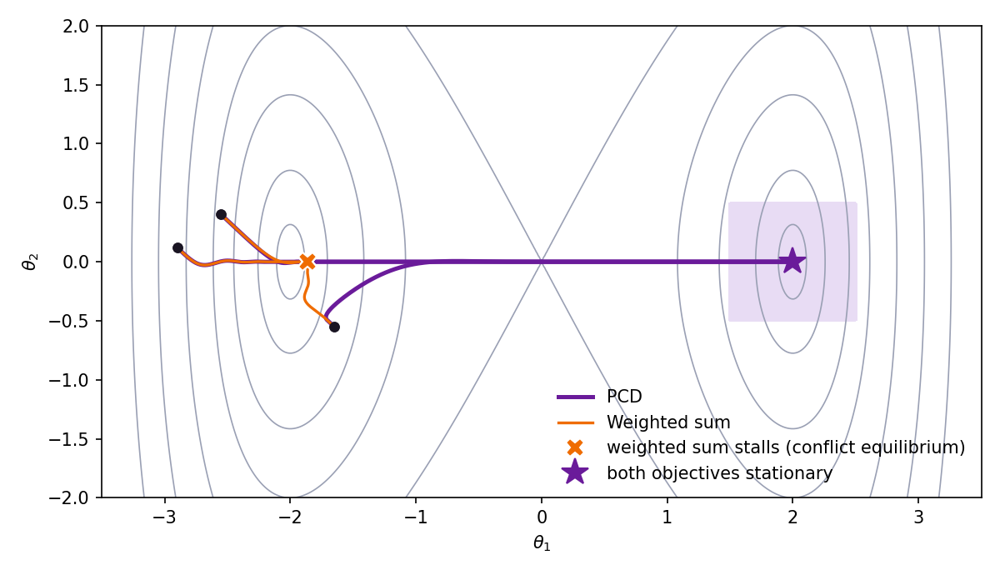

# Priority-Constrained Descent (PCD)

[](https://github.com/DaraVaram/priority-constrained-descent/actions/workflows/tests.yml)

Code for **Not All Objectives Are Born Equal: Priority-Constrained Descent for Hierarchical Multi-Objective Optimization**, by Dara Varam and Mohamed I. AlHajri (*Transactions on Machine Learning Research*, 2026).

[Paper (OpenReview)](https://openreview.net/forum?id=HT01yGHLEt) · [arXiv](https://arxiv.org/abs/2606.29521) · [Project page](https://daravaram.github.io/PCD/)

Many training problems have one objective that is the point, such as task accuracy, and others that only constrain it, such as sparsity or low rank. PCD treats them that way. At every step it takes the direction closest to the primary gradient that still gives each secondary objective a guaranteed share of progress:

$$
\tilde d^\star = \arg\min_{d}\ \tfrac12\lVert d-\tilde g_1\rVert^2
\quad\text{s.t.}\quad \tilde g_j^\top d \ \ge\ \tau\,\lVert\tilde g_j\rVert^2 \quad \text{for every secondary } j .
$$

Here $\tilde g_i$ is objective $i$'s gradient divided by a running estimate of its size, so the single tolerance $\tau \in [0,1]$ means the same thing for every objective, whatever its scale. It replaces all the loss weights. The solution is closed-form for two objectives and is computed exactly for any handful of them.

<p align="center"></p>

*The toy problem of the paper's Fig. 1 ([`examples/toy_conflict.py`](examples/toy_conflict.py)). The primary has two minima; only the right one also satisfies the secondary. A weighted sum stops where the two gradients cancel, while PCD keeps the secondary making progress and ends where both objectives are stationary.*

## Install

```bash
pip install git+https://github.com/DaraVaram/priority-constrained-descent
```

or clone the repository and run `pip install -e .`. The library needs only NumPy and PyTorch ≥ 1.13.

## Usage

```python
import torch
from pcd import PCD

opt = torch.optim.Adam(model.parameters(), lr=1e-3)   # any optimizer
pcd = PCD(model.parameters(), tau=0.02)

for x, y in loader:
    task = criterion(model(x), y)         # the primary objective
    penalty = sparsity(model)             # one or more secondary objectives
    info = pcd.backward([task, penalty])  # in place of loss.backward()
    opt.step()
```

`pcd.backward` takes the primary loss first, then any number of secondaries. It computes one gradient per loss, solves the problem above and writes the result into `.grad`, overwriting whatever was there, so the optimizer steps as usual. The update is rescaled to the length of the primary gradient, for compatibility with standard step sizes and schedules. The returned `PCDInfo` holds the step's diagnostics: the multipliers `mu`, which constraints were `active`, and the `cosine` between the primary and each secondary gradient.

**Choosing τ.** Each step must give every secondary at least a fraction τ of the first-order progress a step along its own normalized gradient would give. At τ = 0 the secondaries are only kept from getting worse to first order; larger τ pushes them harder at the primary's expense. In the paper's pruning experiments the largest gains come from τ ≤ 0.1, and τ = 0.02 is the representative setting. To trace the whole trade-off, sweep τ. It is the only knob.

## Examples

[`examples/quickstart.py`](examples/quickstart.py) is feature selection in about thirty seconds on a CPU. Only 5 of 40 inputs carry signal, the primary is the classification loss, and the secondary is a group lasso over the first layer's input columns. One run printed the following; the exact numbers vary a little with platform and PyTorch version:

```
 tau   test acc   features kept   informative kept
0.00     84.6%       40 / 40          5 / 5
0.05     95.0%       40 / 40          5 / 5
0.10     97.9%       12 / 40          5 / 5
0.20     98.3%        5 / 40          5 / 5
0.50     95.7%        5 / 40          5 / 5
```

[`examples/toy_conflict.py`](examples/toy_conflict.py) reproduces the figure above (`--plot toy.png` to draw it).

## Applying PCD to your own problem

- **Put the objective you care about first.** PCD stays as close as it can to the first loss's gradient. The others are constraints and are treated alike, so their order does not matter.
- **Secondaries can be nonsmooth.** ℓ1, group lasso, nuclear norm and hinge penalties all work with the subgradients autograd returns, as in the paper's experiments.
- **Loss weights are unnecessary.** Each gradient is normalized by a running average of its own norm, so multiplying a secondary loss by a constant does not change the update.
- **Per-objective tolerances.** `PCD(params, tau=[0.02, 0.1])` gives each secondary its own τ.
- **Gradients from elsewhere.** `pcd.apply_gradients(grads)` takes precomputed gradients, where `grads[i][k]` is the gradient of loss `i` with respect to parameter `k` (or `None`). Use it for data-parallel training, since DDP synchronizes gradients during `loss.backward()` and not under `torch.autograd.grad`: all-reduce each loss's gradients, then call it. Use it for gradient accumulation too, since PCD is not linear in the gradients: accumulate each loss's gradient over the micro-batches, then call it once.
- **Other frameworks.** The solver needs only the K×K Gram matrix of the gradients, so all of Algorithm 1 is a few lines of NumPy:

  ```python
  import numpy as np
  from pcd import EMANormalizer, solve_qp

  normalizer = EMANormalizer(beta=0.999, eps=1e-8)      # one per training run

  def pcd_direction(G, tau):
      """G: (K, n) array of this step's gradients, primary first."""
      gram = G @ G.T
      s = normalizer(np.diag(gram))                     # per-objective scales
      if gram[0, 0] == 0:
          return np.zeros(G.shape[1])                   # primary is stationary: no step
      w = solve_qp(gram * np.outer(s, s), tau).weights  # d~* = sum_i w_i s_i g_i
      d = (w * s) @ G
      norm = np.linalg.norm(d)
      return d * np.sqrt(gram[0, 0]) / norm if norm > 0 else d
  ```

- **Cost.** PCD needs one backward pass per objective, like any method that manipulates per-objective gradients, plus a K×K solve. In the paper's K = 2 runs it added under 2% wall-clock time over a weighted sum. The solver enumerates at most 2^(K−1) active sets, which is instant for the handful of objectives PCD is meant for. For many more, a dual active-set QP solver (Goldfarb–Idnani, as in the `quadprog` package) can replace `solve_qp`.
- **What is guaranteed.** For τ > 0, every step gives each secondary its τ-share of normalized first-order progress (exactly for smooth secondaries; for nonsmooth ones the paper quantifies the gap), and the normalized direction vanishes only where every objective is stationary. These are properties of the direction. No convergence theorem is claimed for training with an adaptive optimizer. With three or more objectives the constraints can be mutually incompatible, for example two secondaries with exactly opposite gradients. PCD then drops them for that step and follows the primary, and `info.feasible` is `False`. In high dimensions this essentially never happens; it never did in the paper's experiments.

## Reproducing the paper

[`experiments/`](experiments/) trains the paper's CIFAR models. That covers structured pruning with a group lasso (K = 2; ResNet-34, DenseNet-121, Inception, MobileNetV2) and joint sparsity and low rank with ℓ1 and nuclear-norm penalties (K = 3; ResNet-34, Inception):

```bash
pip install -e ".[experiments]"
python experiments/train.py --task pruning --arch resnet34 --dataset cifar100 --tau 0.02
python experiments/train.py --task sparse-lowrank --arch resnet34 --dataset cifar10 --tau 0.02
```

[`experiments/README.md`](experiments/README.md) has the full sweeps, the metric definitions, the reproducibility checklist, and how this code relates to the research code.

## Tests

```bash
pip install -e ".[test]"
pytest
```

The tests check the solver against the paper's closed forms, the KKT conditions and an independent projection algorithm, and run the PyTorch front end end to end.

## Citation

```bibtex
@article{varam2026pcd,
  title         = {Not All Objectives Are Born Equal: Priority-Constrained
                   Descent for Hierarchical Multi-Objective Optimization},
  author        = {Varam, Dara and AlHajri, Mohamed I.},
  journal       = {Transactions on Machine Learning Research},
  issn          = {2835-8856},
  year          = {2026},
  url           = {https://openreview.net/forum?id=HT01yGHLEt},
  eprint        = {2606.29521},
  archivePrefix = {arXiv},
  primaryClass  = {cs.LG}
}
```

## License

MIT. See [LICENSE](LICENSE).
